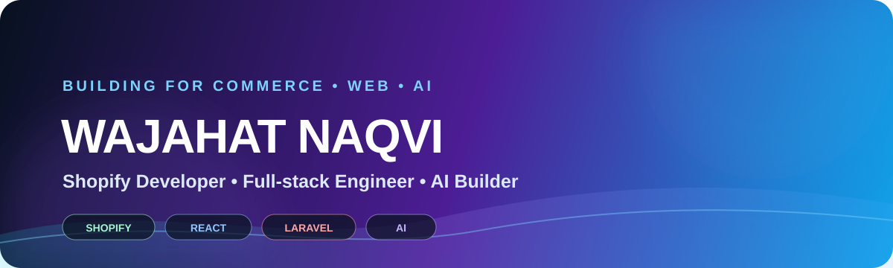

<p align="center">
  
</p>

<p align="center">
  <a href="https://wajahatalinaqvi.github.io">
    
  </a>
  <a href="https://github.com/wajahatalinaqvi?tab=repositories">
    
  </a>
  
</p>

<h3 align="center">I turn Shopify problems into products — and product ideas into working software.</h3>

<p align="center">
  Shopify apps • Custom storefronts • React / Next.js • Laravel • APIs • Automation • AI-powered tooling
</p>

---

## ⚡ BUILD MODE

I’m a **Shopify-focused full-stack developer** who likes building things that sit at the intersection of **commerce, product UX, backend systems, and automation**.

I work across the full flow — from polished storefront experiences and embedded Shopify apps to APIs, queues, dashboards, integrations, and AI-assisted workflows.

```text
idea → UX → frontend → API → data → automation → ship
```

> **Current direction:** Full-stack development with deep Shopify expertise, strong React/Laravel foundations, and practical AI integrations.

---

## 🚀 FEATURED BUILDS

<table>
<tr>
<td width="50%" valign="top">

### [LinkedIn Pro Agent](https://github.com/wajahatalinaqvi/linkedin-pro-agent)

A priority-driven content system that researches verified tech stories, scores them, prepares LinkedIn + X content, generates previews, and keeps final publishing under human approval.

**Built around:** Python • GitHub Actions • Playwright • LinkedIn API • content scoring • V3 carousel rendering

</td>
<td width="50%" valign="top">

### [Shopify Customer Wishlist API](https://github.com/wajahatalinaqvi/brainxTest-wishlist-app)

A lightweight Shopify wishlist backend that stores customer wishlists directly in **Shopify metafields** and resolves saved products through the Admin API.

**Built around:** Node.js • Express • Shopify Admin API • Netlify Functions • Liquid

</td>
</tr>

<tr>
<td width="50%" valign="top">

### [quickdebugger](https://github.com/wajahatalinaqvi/quickdebugger)

A small developer utility for wrapping async functions and surfacing **execution time, memory usage, and error traces** during debugging.

**Built around:** JavaScript • Node.js • React-friendly instrumentation

</td>
<td width="50%" valign="top">

### [DjordanMedia v2](https://github.com/wajahatalinaqvi/DjordanMedia-v2)

Shopify theme development work with custom **Liquid sections, snippets, templates, assets, and storefront UX**.

**Built around:** Shopify Liquid • JavaScript • CSS • Theme architecture

</td>
</tr>
</table>

---

## 🧰 MY TOOLBOX

<p align="center">
  
</p>

<p align="center">
  
  
  
  
  
  
  
</p>

---

## 🧠 WHAT I LIKE BUILDING

| Commerce | Product Engineering | AI + Automation |
|---|---|---|
| Shopify apps | React / Next.js interfaces | Research & content agents |
| Theme architecture | Laravel APIs | Human-in-the-loop workflows |
| Checkout / post-purchase UX | Dashboards & admin systems | AI-assisted analysis |
| Storefront performance | Webhooks, queues & integrations | Tool orchestration |

---

## 📈 GITHUB SNAPSHOT

<p align="center">
  
  
</p>

---

## 🎯 THE WAY I BUILD

```text
01  Understand the business problem.
02  Make the UX feel obvious.
03  Keep the architecture maintainable.
04  Automate repetitive work.
05  Measure what actually matters.
06  Ship — then improve.
```

---

## 🤝 LET'S BUILD SOMETHING USEFUL

If you’re working on a **Shopify app, ecommerce experience, React/Laravel product, or AI-powered workflow**, I’m interested in solving the hard part — not just making the screen look finished.

<p align="center">
  <a href="https://wajahatalinaqvi.github.io">
    
  </a>
  <a href="https://github.com/wajahatalinaqvi?tab=repositories">
    
  </a>
</p>

<p align="center">
  <sub>Commerce-first. Product-minded. Always building.</sub>
</p>
